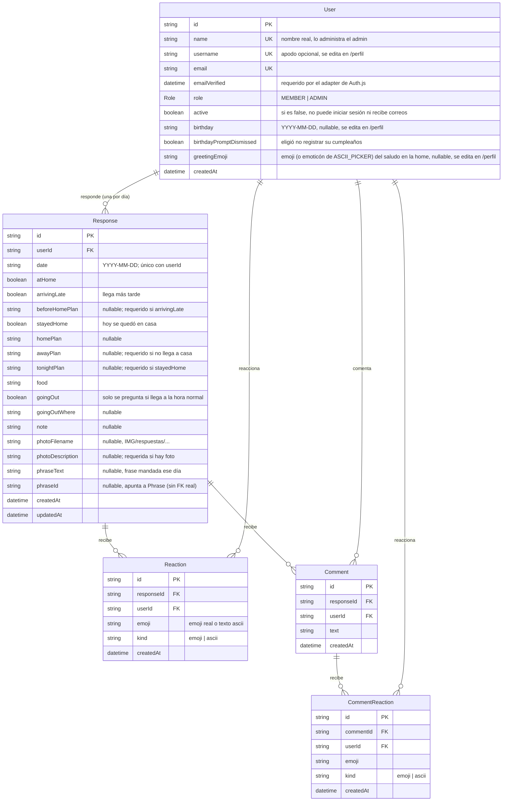
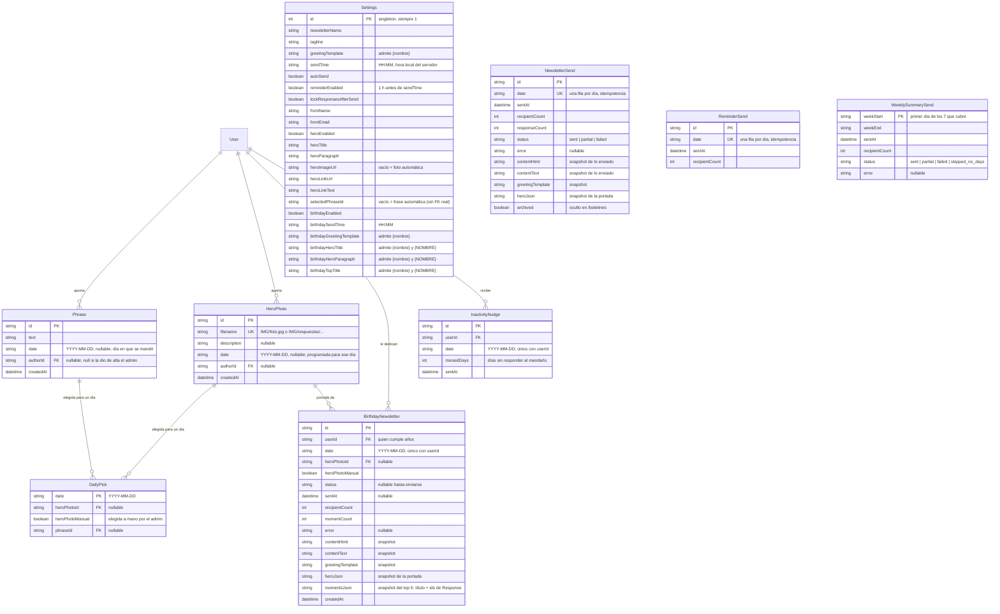
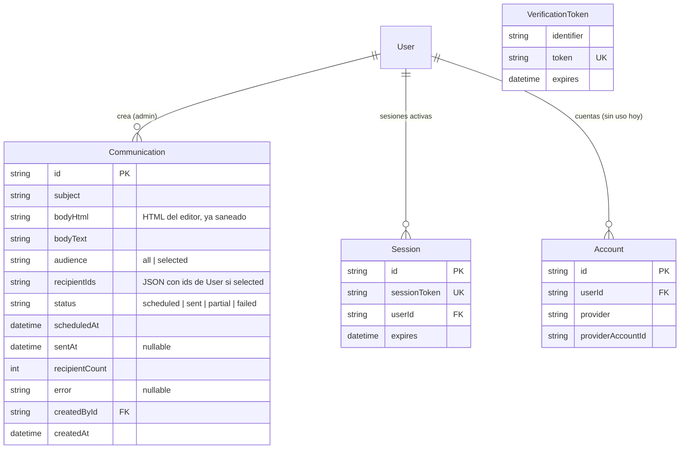

# Base de datos

> Ver también: [`ARQUITECTURA.md`](./ARQUITECTURA.md). Fuente de verdad
> real: `prisma/schema.prisma` — si este documento y el schema alguna vez
> no coinciden, el schema manda.

SQLite (`data/app.db`, gitignored), un solo archivo, Prisma 7 con driver
adapter (`@prisma/adapter-better-sqlite3`), sin query engine embebido.
Cliente generado en `src/generated/prisma` (también gitignored, se
regenera con `npx prisma generate`).

## Diagrama entidad-relación

Dividido en tres partes para que se lea; las relaciones con `User` se
repiten donde hace falta.

### Respuestas e interacción

### Boletines, portada y envíos

### Comunicaciones y autenticación

## Notas sobre el modelo

### Usuarios

- **`User.name` vs `User.username`**: `name` es el nombre real, lo pone el
  admin y es único. `username` es un apodo opcional (también único, pero
  `NULL` no choca consigo mismo en SQLite) que cada quien edita en
  `/perfil`. Todo lo público (boletín, comentarios, reacciones) usa
  `username` si está puesto y si no `name` — ver `src/lib/display-name.ts`.
  El saludo del correo sí usa siempre `name`.
- **`User.active = false`** no borra nada: la persona no puede iniciar
  sesión ni recibe correos (boletín, recordatorio, avisos de interacción),
  pero sus respuestas siguen en el historial.
- **`User.birthday`** es la fecha completa, pero solo se usan mes y día
  (ver "Boletín de cumpleaños" abajo).

### Respuestas

- **`Response` es única por `(userId, date)`**: volver a responder el
  mismo día actualiza la fila. `date` es un string `"YYYY-MM-DD"`, no un
  `DateTime`, para no lidiar con zonas horarias al comparar fechas.
- **Los cuatro flujos del formulario** (llega a la hora normal, llega
  tarde, no llega, se quedó en casa) comparten la tabla: `atHome`,
  `arrivingLate` y `stayedHome` dicen cuál fue, y las reglas de qué campo
  es obligatorio en cada uno viven en `src/lib/response-schema.ts`.
- **Foto de la respuesta**: el archivo vive en `data/uploads/respuestas/`
  (fuera de `public/`, ver `ARQUITECTURA.md`), pero `photoFilename` guarda
  el nombre lógico `IMG/respuestas/<archivo>`, que es la URL con la que
  se sirve. Además se da de alta como `HeroPhoto` (con autor y fecha) para
  entrar a la rotación de portadas.
- **Frase de la respuesta**: `phraseText` guarda el texto (para precargar
  el formulario al editar) y `phraseId` apunta a la fila creada en
  `Phrase`, para actualizarla en vez de duplicarla. No es FK real.

### Interacción

- **`Reaction` y `CommentReaction`** tienen `@@unique([…Id, userId, emoji])`:
  una persona puede reaccionar con varios emojis distintos, pero solo una
  vez con cada uno; repetir el mismo lo quita (toggle). `kind` solo sirve
  para pintar distinto los emojis y los emoticones ascii. Están en tablas
  separadas para no mezclar reacciones a respuestas con reacciones a
  comentarios (p. ej. el top 5 de cumpleaños solo cuenta las primeras).
- **`Comment`** es un hilo plano por respuesta, en orden cronológico.
- Todo se borra en cascada con la respuesta o con el usuario.

### Portada del boletín

- **`HeroPhoto` se sincroniza sola** con lo que haya en `public/IMG`
  (`syncHeroPhotos()` en `src/lib/hero-photos.ts`): agrega las fotos
  nuevas y borra las que ya no están en disco. Las fotos de respuestas
  (`IMG/respuestas/…`) se excluyen de esa limpieza porque viven en otro
  lado.
- **`DailyPick`** fija la foto y la frase de la portada de un día la
  primera vez que se resuelven (o cuando el admin las elige a mano o las
  re-rola), para que la vista previa y el envío real coincidan y la
  portada no cambie sola a media tarde.
- **`Settings.selectedPhraseId`** no es FK real (vacío = modo automático);
  se resuelve en `src/lib/phrases.ts`.

### Envíos

- **Idempotencia**: `NewsletterSend` y `ReminderSend` tienen `date` único,
  y `BirthdayNewsletter` es único por `(userId, date)`. El worker revisa
  si ya existe el envío antes de mandar, así que aunque el cron corra de
  más o el proceso se reinicie, nunca sale dos veces lo mismo (salvo
  reenvío forzado desde el panel).
- **Snapshots congelados**: al enviarse, `NewsletterSend` y
  `BirthdayNewsletter` guardan el contenido tal cual salió
  (`contentHtml`, `contentText`, `heroJson` y, en cumpleaños,
  `momentsJson`). `/boletines` y el panel muestran eso en vez de
  reconstruirlo con los Ajustes actuales, que pueden haber cambiado. Los
  envíos anteriores a esos campos los tienen vacíos y se reconstruyen.
- **`BirthdayNewsletter`** es tabla aparte de `NewsletterSend` porque el
  día del cumpleaños también sale el diario (único por fecha). La fila
  nace al resolver la foto de portada (vista previa o envío) y hace de
  `DailyPick` de esa edición; `sentAt` se llena al enviarse.
- **`Communication`** son correos sueltos del admin, de inmediato o
  programados (`scheduledAt`); el worker manda los programados cuando
  llega su hora.
- **`WeeklySummarySend`** hace idempotente el resumen semanal (uno por
  semana, por `weekStart`). **`InactivityNudge`** guarda cada correo de
  "llevas N días sin responder": además de evitar repetirlo el mismo día,
  es el historial con el que se decide el siguiente (a los N, 2N, 3N…
  días de la misma racha; ver `pendingInactivityNudges()`).

### Otros

- **`Settings` es un singleton**: siempre `id = 1`, se crea con
  `upsert` la primera vez que hace falta, sin seed obligatorio.
- **`Account` / `Session` / `VerificationToken`** son los modelos estándar
  de `@auth/prisma-adapter`. `Account` existe por completitud, pero no
  hay login social: solo enlace mágico por correo.
- **Migraciones** en `prisma/migrations/`, aplicadas con
  `npx prisma migrate deploy` (nunca `migrate dev` fuera de desarrollo
  local). En SQLite, para agregar columnas se prefiere `ALTER TABLE …
  ADD COLUMN` escrito a mano: el `migrate diff` de Prisma a veces propone
  recrear la tabla completa, que es más riesgoso sobre datos reales.
